+++
title = 'Visualizaciones científicas con Python para agricultura e investigación'
date = '2026-03-06T03:25:38-05:00'
draft = false
description = 'Conjunto de gráficas realizadas en Python.'
tags = ['python', 'investigación']
categories = []

weight = 1
showtoc = true
ShowPostNavLinks = true

+++

## Importancia

Los gráficos deben cumplir el objetivo de transmitir un mensaje al espectador, mucho mejor si personas ajenas al público ojetivo logran captar dicho mensaje. Para su elaboración se dispone de una gran variedad de herramientas, siendo este el caso de usar lenguajes de programación, ya que permite tener el mayor control posible sobre los gráficos a elaborar, además de quedar mucho mejor que los gráficos elaborados en Excel.

La ventaja de realizar una gráfica usando lenguajes de programación (sea Python, R, o incluso JavaScript) es la posibilidad de realizar muchos cambios y ajustar nuestras necesidades al gráfico, siendo esto a su vez una desventaja ya que se requiere de un mayor conocimiento sobre las opciones disponibles, métodos y formas para obtener dicho gráfico.

## Gráficas con Python

Python permite elaborar gráficas mediante el uso de libreríasa específicas, siendo el más conocido Matplotlib. Entre otras librerías tenemos:

- Matplotlib
- Seaborn
- Pandas
- Altair
- Plotly
- Bokeh

## Eligiendo una librería

Según nuestra necesidad, Los gráficos pueden ser estáticos o interactivos. Los gráficos estáticos son meramente eso, estáticos. Se presentan en documentos, presentaciones y cumplen la función de mostrar un mensaje. Los gráficos interactivos por su parte, permiten interactuar con los datos empleados. Estos pueden integrarse en aplicaciones y dashboards, entre otras más.

A continuación presento una imagen que nos ayudará a decidir qué librería podemos usar de acuerdo a nuestra necesidad.

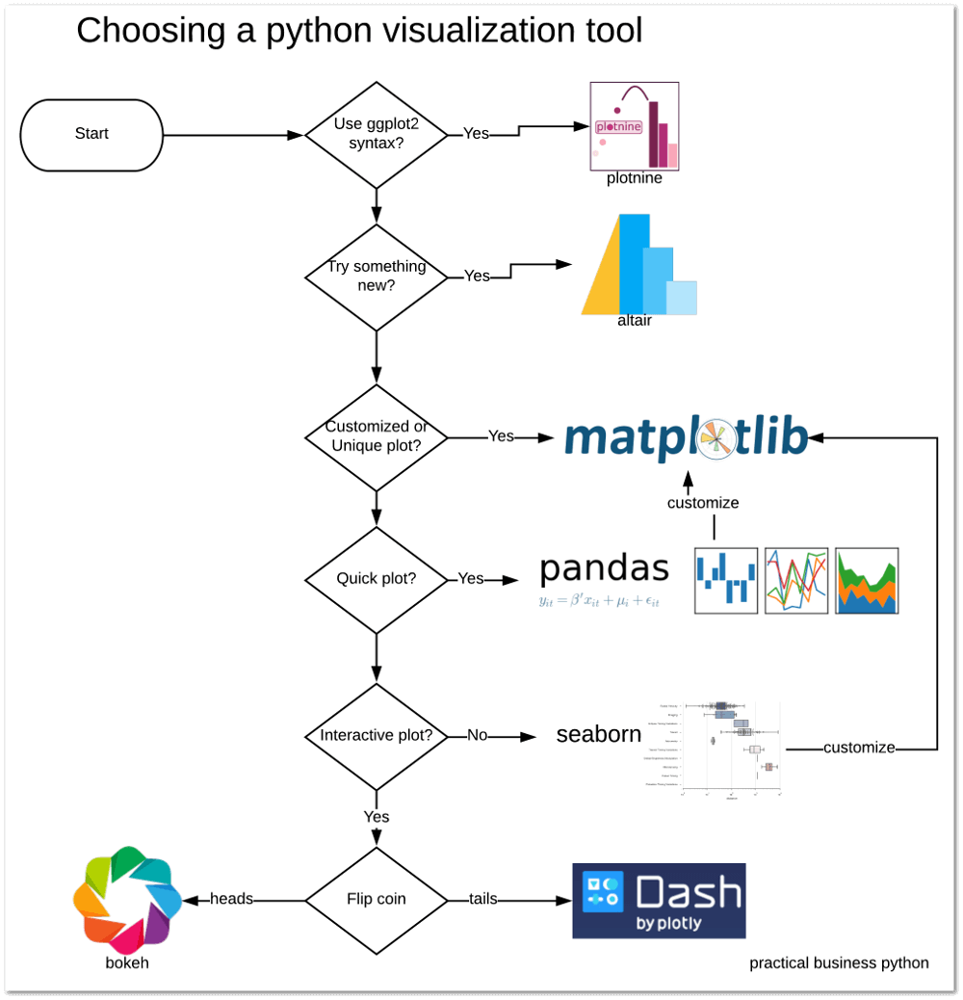

El siguiente paso es dirigirnos a su documentación. Todas las librerías mencionadas poseen documentación online de acceso libre por lo que es cuestión de uno el aprender su uso.

Algunos comentarios sobre las librerías:
- **Matplotlib**: Librería más conocida, permite hacer muchas cosas pero otras librerías ya agilizan su uso.
- **Pandas**: Usa Matplotlib. No es como tal una librería para graficación pero permite realizar gráficas rápidas a partir de un dataframe.
- **Seaborn**: También usa Matplotlib. Añade métodos para graficar cosas más complejas que tomaría muchas líneas de código su implementación al solo usar Matplotlib.
- **Bokeh y Plotly**: Permiten realizar gráficos interactivos pero se requiere de conocimiento de programación web para su implementación.

## Ejemplos

En esta sección les presento las gráficas realizadas con la librería matplotlib.

### Curvas de absorción de nutrientes

Se realizaron gráficas para un manual de fertilización en cultivos de ajo y cebolla, el cual se encuentra disponible en el [repositorio institucional del INIA](http://hdl.handle.net/20.500.12955/2836). A partir de datos medidos en campo en dos variedades de ajo y cebolla a distintas fechas, se elaboró el ajuste de curvas a una función sigmoide (curva S) que representen la absorción de nutrientes NPK.

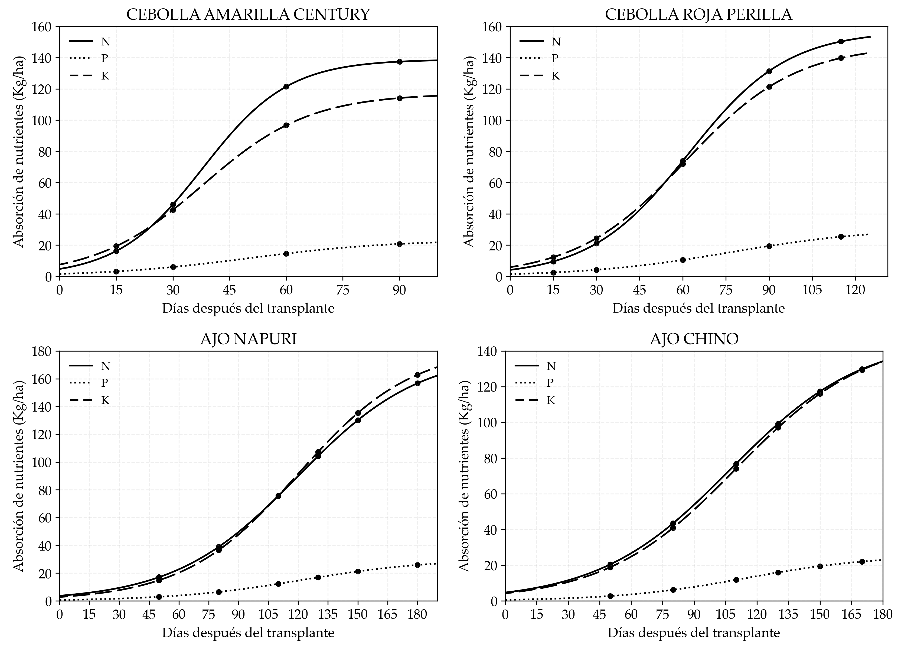

Esta figura fue desarrollada para representar el proceso de absorción a través de los días para el nitrógeno. Se observa que las cantidades requeridas son diferentes, las cuales son representadas como áreas de forma sombreada.

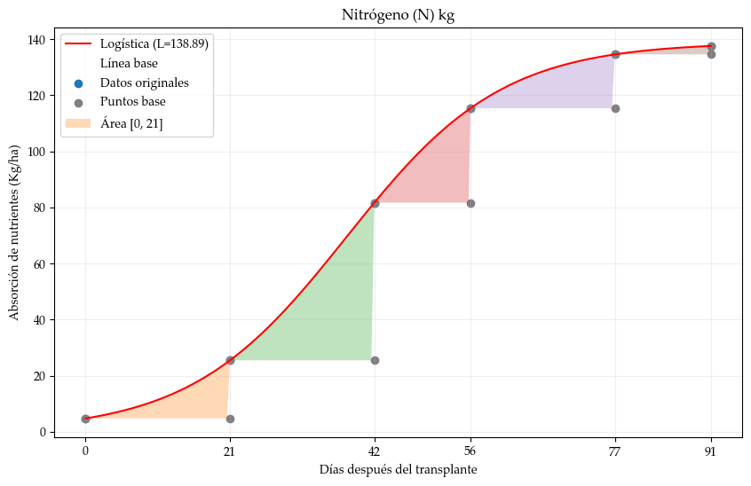

### Datos meteorológicos
Aquí se presentó de forma temporal las variables temperatura, precipitación y evapotranspiración
potencial mediante datos medidos en estación meteorológica. Los datos de evapotranspiración
potencial fueron completados con la librería pyet. Una gráfica similar se encuentra en un artículo ya publicado ([Poma-Chamana *et al*., 2025](https://doi.org/10.3389/fagro.2025.1663633)).

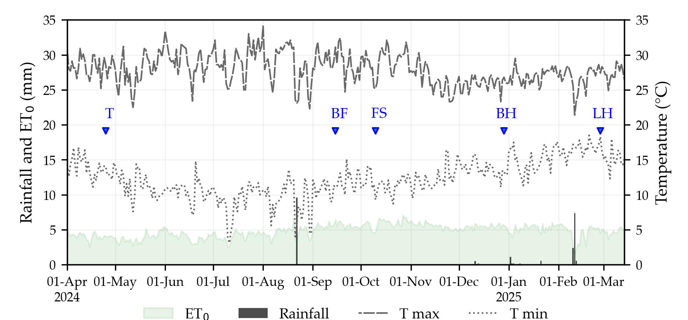

### Resultados de modelos GLMM
A partir del análisis de modelos lineales generalizados mixtos (GLMM), se obtuvo las curvas
de las variables Clorofila y Altura, donde se buscó modelar a lo largo del tiempo de evaluación.

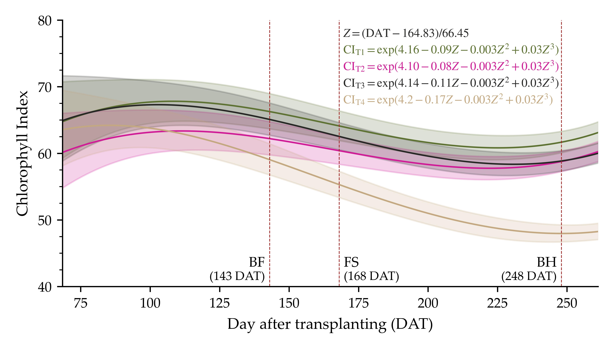
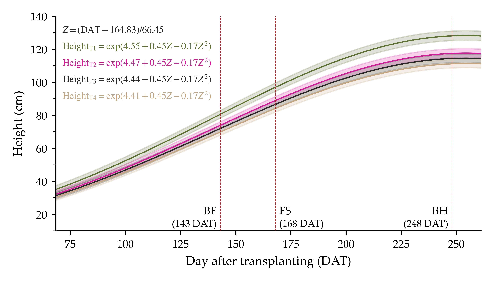

Estas gráficas fueron desarrolladas para un artículo que se encuentra actualmente sometido, las cuales fueron mejoradas a partir de los ya realizados en un artículo previo ya publicado ([Poma-Chamana *et al*., 2025](https://doi.org/10.3389/fagro.2025.1663633)).

### Tiempo de irrigación y Humedad del suelo

En esta gráfica se representa dos en una, donde en la parte superior se muestra los tiempos de 
riego aplicados en cuatro tratamientos en una investigación donde se evaluó la eficiencia del uso de coberturas en el cultivo de rocoto ([Poma-Chamana *et al*., 2025](https://doi.org/10.3389/fagro.2025.1663633)).

  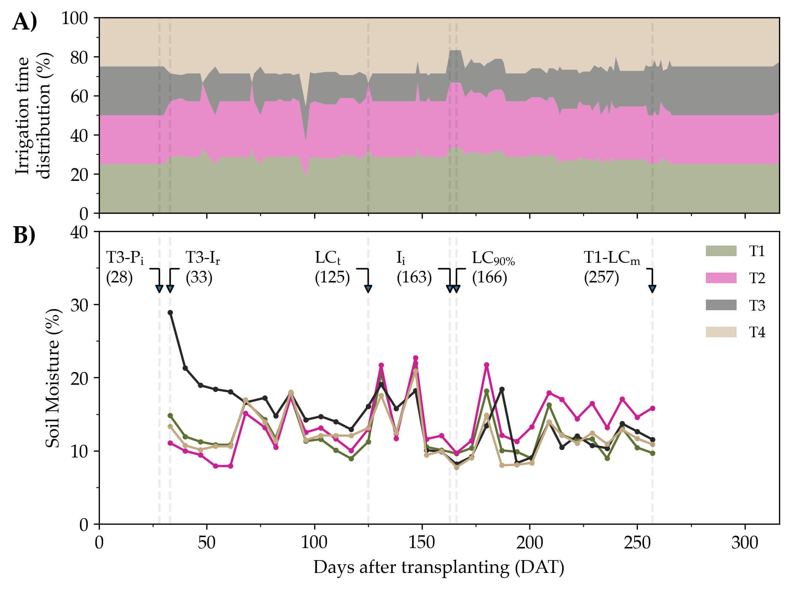

<!--  -->

### Gráfica de barras

Representación del carbono orgánico del suelo y materia seca en investigación del cultivo ají. Se presenta dos formas en función del enfoque: comparar tratamientos u otros datos categóricos como diferentes tipos de materia seca. Las letras de diferencias significativas se añadieron, las cuales fueron obtenidas por el test post-hoc de Dunn. 
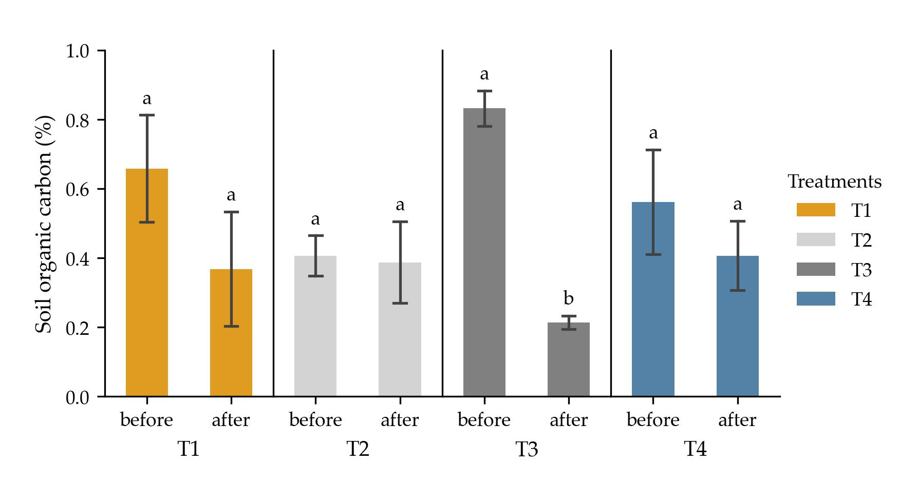
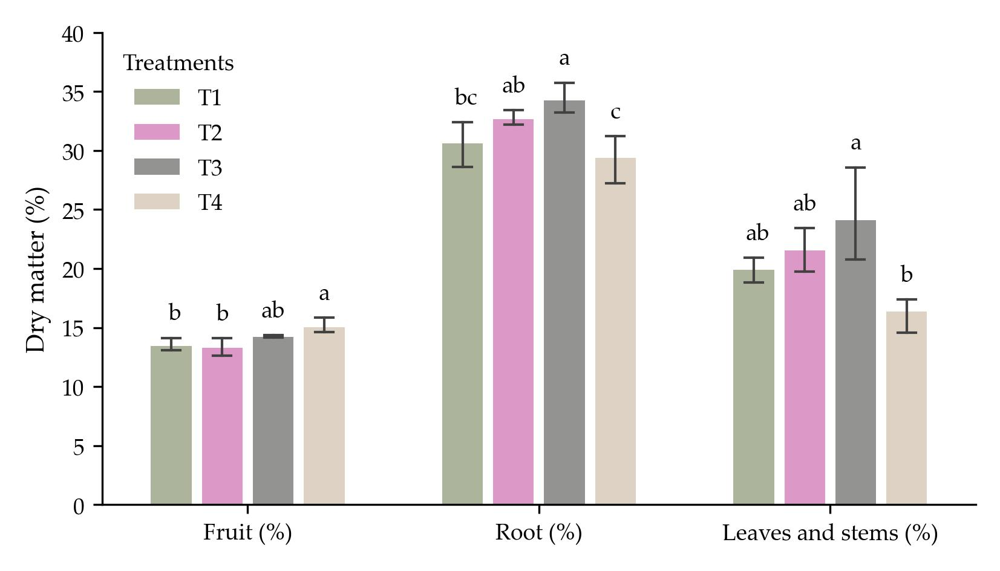

### Gráficos boxplot

Para un artículo sobre la evaluación del índice de estrés hídrico sobre el cultivo de maíz en Lambayeque ([Cruz-Grimaldo *et al*., 2025](https://doi.org/10.4995/raet.2026.23671)), se desarrolló la siguiente gráfica donde se representa su variación a lo largo de su ciclo vegetativo y reproductivo para cuatro tratamientos diferenciados por tasas de riego. 

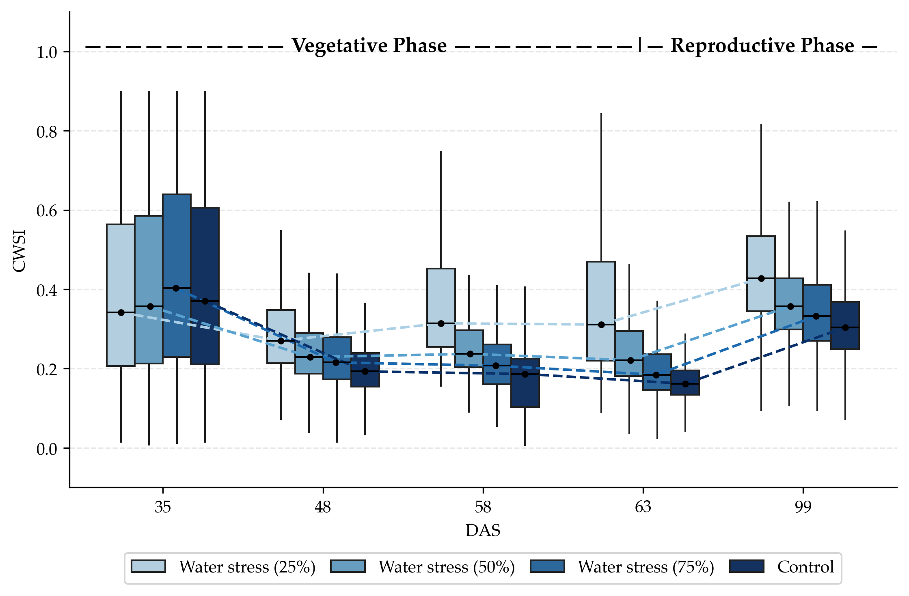

Los siguientes gráficas se desarrollaron para representar distintas variables medidas en campo en diferentes fechas de evaluación en el cultivo de ají. 

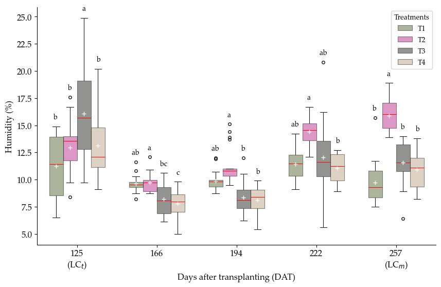
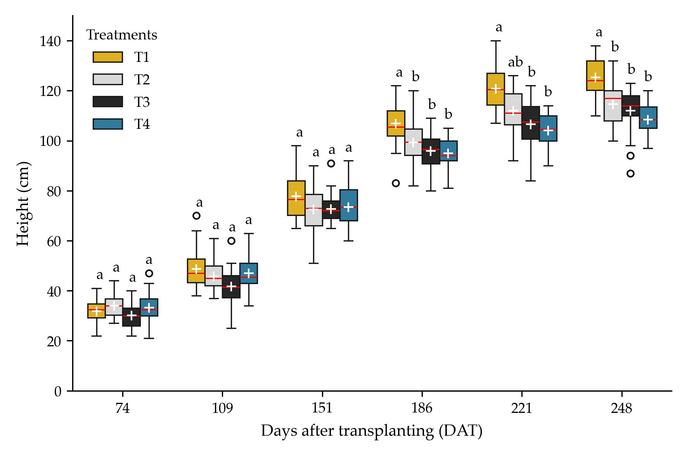
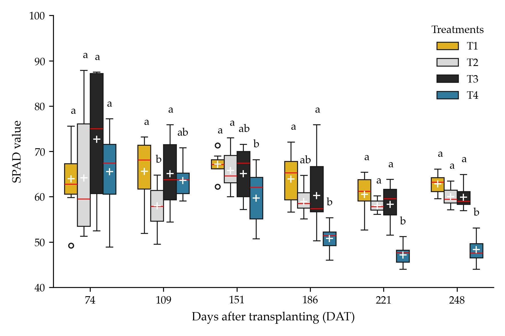

### Gráficas con líneas

Para mi tesis, se realizó la gráfica del proceso iterativo, fase importante en el modelo METRIC para estimar la evapotranspiración a partir de imágenes satelitales. Se observa que las iteraciones convergen en un valor en cierta iteración, indicando que a mayor número de iteraciones el resultado variará de forma insignificante.
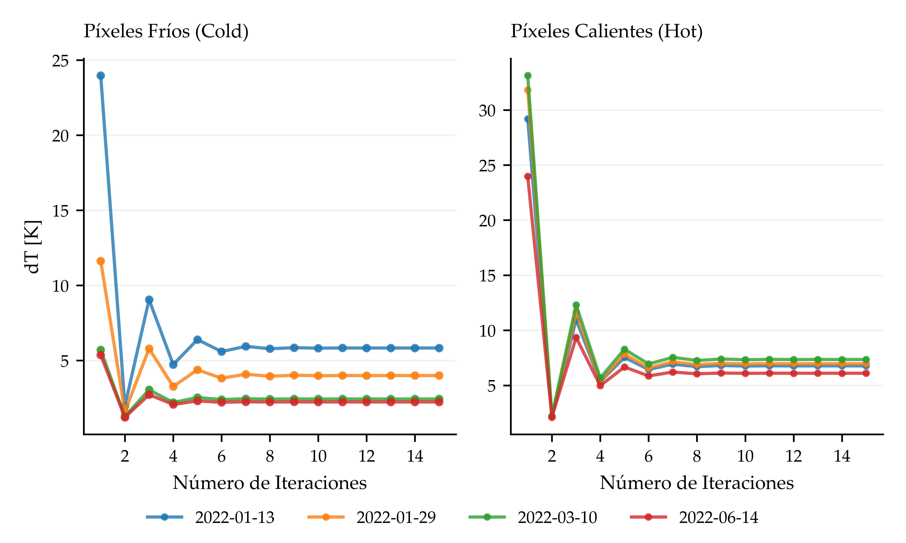

### Gráficos interactivos con plotly

Con Plotly desarrollé una visualización interactiva con los datos de temperatura de la estación meteorológica Tinajones para las 3pm. Posteriormente se corrigió para la hora 11am (paso de satélite Landsat).

  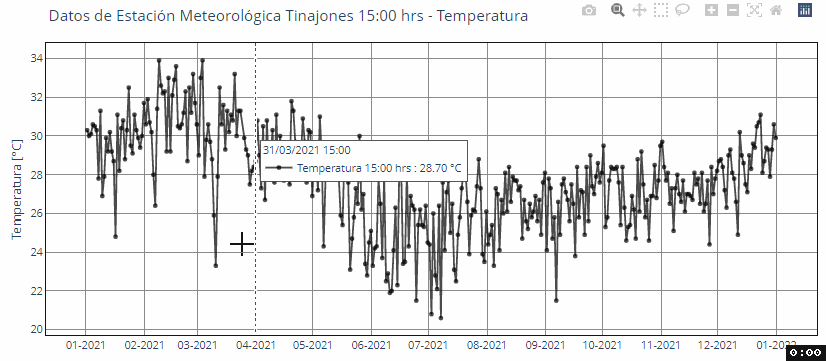

### Imágenes satelitales con geemap

Con la librería geemap fue posible elaborar un gif a partir de imágenes Landsat 9 y Sentinel-2. Se representó la variación temporal y espacial de arrozales en Lambayeque. 

  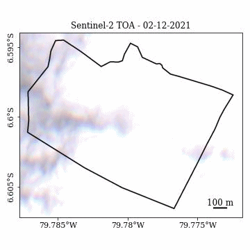
  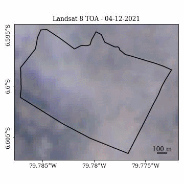

Para mi tesis, se plasmó los focos de calor en función al filtrado de valores NDVI y de temperatura, necesarios en el modelo METRIC.

  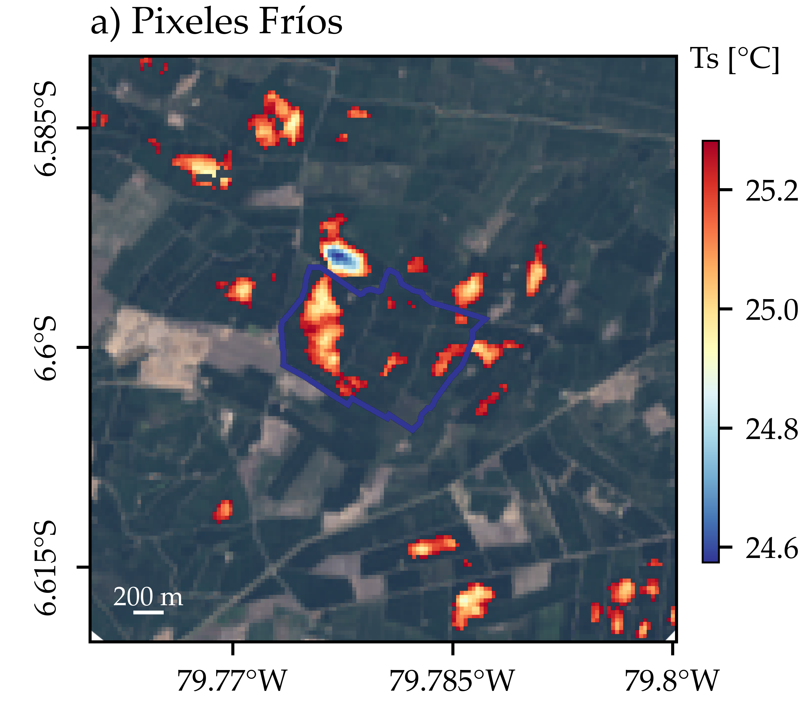 
  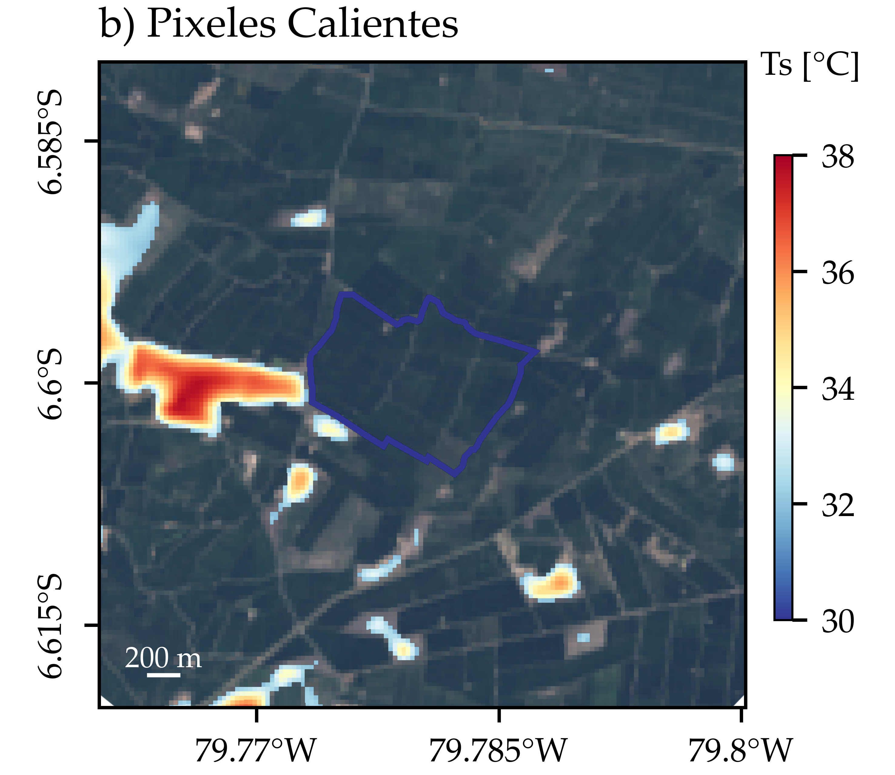

## Referencias

- Matplotlib
  - [Matplotlib: Visualization with Python](https://matplotlib.org/)

- Plotly
  - [Plotly Python Open Source Graphing Library](https://plotly.com/python/)
  - [Graph Objects in Python](https://plotly.com/python/graph-objects/)
  - [Plotly: Colours list](https://community.plotly.com/t/plotly-colours-list/11730)
  - [Plotly: Axes in Python](https://plotly.com/python/axes/)
  - [Stackoverflow: Plotly: How to change the background color of each subplot?](https://stackoverflow.com/questions/61631230/plotly-how-to-change-the-background-color-of-each-subplot)
  - [Plotly: Cambiar formato de Hover para fechas con XHOVERFORMAT](https://digitallythrive.com/how-to-format-plotly-hover-dates-show-month-days-year/)
  - [Plotly: Hover Text and Formatting in Python](https://plotly.com/python/hover-text-and-formatting/)
  - [Time Series and Date Axes in Python](https://plotly.com/python/time-series/)
  - [Creating and Updating Figures in Python](https://plotly.com/python/creating-and-updating-figures/)
- Blogs
  - Practical Business Python - [Choosing a Python Visualization Tool](https://pbpython.com/python-vis-flowchart.html)
  - Medium - [PyViz: Simplifying the Data Visualisation process in Python](https://towardsdatascience.com/pyviz-simplifying-the-data-visualisation-process-in-python-1b6d2cb728f1)

Estos son las gráficas más representativas que he realizado para investigaciones hasta la fecha usando Python. Conforme vaya generando más, las iré incluyendo por aquí. 

Muchas gracias por leer. Te invito a revisar los demás posts mediante los tags aquí abajo.

