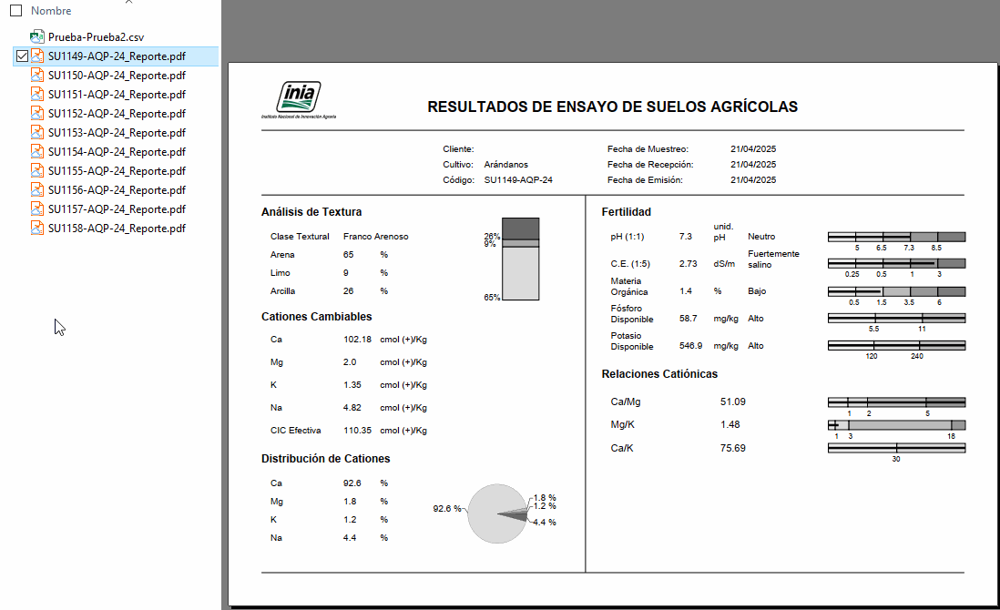

+++
title = 'Generación de reportes PDF con Python y ReportLab'
date = '2026-03-06T03:35:27-05:00'
draft = false
description = 'Presentar el proceso para elaborar un reporte PDF usando el lenguaje de programación Python.'
tags = ['python']
categories = []

weight = 3
showtoc = true
ShowPostNavLinks = true
+++

En este post les presento la forma de generar reportes automatizados en PDF a partir de archivos .csv. Se tiene datos de resultados de análisis de laboratorio como ejemplo práctico.

A partir de datos en Excel (sea .xlsx o .csv) se generó un reporte del siguiente tipo:

Donde se puede notar que presenta información del cliente, resultados en forma numérica y gráfica.

Ahora el cómo se generó si que fué algo complicado de realizar. Se buscó librerías que permitan generar reportes y sólo había información de implementaciones para plataformas web, ya que un ejemplo sería el de emitir boletas electrónica.

Encontré la librería ReportLab que resultó amigable pero no estaba preparado para lo que me esperaba: elaborar un PDF.

## Librería ReportLab

ReportLab es una una herramienta poderosa y flexible que permite crear documentos en el Formato de Documento Portátil de Adobe (PDF) usando el lenguaje Python.

Entre sus principales características se tiene:

- Generación de PDFs complejos con Python
- Creación de elementos gráficos
- Soporte para tablas
- Flexibilidad de diseño
- Código abierto

Los documentos que se pueden generar se presentan a continuación:

- Generación de informes a partir de bases de datos.
- Generar facturas personalizadas de clientes y productos.
- Creación de certificados para eventos, cursos o logros.
- Generación de gráficos
- Documentación automatizada

Esta herramienta es poderosa pero presenta una curva de aprendizaje tediosa, especialmente para diseños complejos y elaborados. Proporciona un control muy preciso pese a su complejidad de uso.

## Elaboración del reporte
### Datos a usar
En el editor web Google Colab, importamos nuestros datos. En mi caso he conectado mi cuenta de Google Drive a la libreta para acceder a mis datos. A continuación se presenta la tabla a extraer datos.

Se procede a revisar que cada columna presente el tipo de dato correcto, ya que en algunas partes se usan los datos numéricos para realizar operaciones matemáticas.

Se observa que hay campos de tipo float64 que serían números con decimales, así como de tipo int64 los cuales serían números enteros. Los de tipo object son detectados como textos.

### Partes del reporte

Se procedió a identificar los puntos a presentar en el reporte:

- Título del documento
- Información del cliente
- Secciones de resultados
- Gráficos de barra y pie
- Líneas divisorias

### Instalando ReportLab

Ya que estamos usando Colab, la instalación se realiza mediante el siguiente comando:

### Elaborando una función que genere los reportes

Se busca generar un reporte para cada fila en la tabla mostrada previamente. Para el presente ejemplo se tiene 10 filas por lo que debe realizarse 10 reportes. Dicha función debe ser sencilla de usar así que la he diseñado para que solo reciba por argumento la ruta del archivo .csv. La función generará un reporte para cada fila que tenga el archivo .csv que se le adjunte, y en la misma carpeta donde se ubique dicho archivo.

A continuación se presenta una parte de la función elaborada. Al final del post adjunto el enlace para el acceso al código completo.

Finalmente se realiza la generación del reporte.

Se han generado 10 reportes para cada fila dentro del archivo .csv.

Para revisar el código, les comparto la libreta empleada la cual se encuentra alojada en mi [repositorio de GitHub](https://github.com/vilcagamarracf/Python_Snippets/blob/main/GenerarPDF.ipynb).

### Algunos detalles
El código escrito para el presente ejemplo se tornó muy extenso, llegando a alcanzar solamente para la función alrededor de 735 líneas de código (incluyendo comentarios).

Las partes más complicadas de realizar se mencionan a continuación:
- Entender que el PDF es como un lienzo en blanco que a su vez actúa como un sistema de coordenadas, donde cada cosa que irá en el PDF lleva una coordenada.
- Incluir el logo y ubicarlo en la esquina superior izquierda.
- Dividir la hoja en dos columnas y probar las coordenadas junto con espaciamientos entre textos.
- Realizar tablas y que no se rompa la estructura de ellas cuando hay textos que presentan dos líneas de texto.
- Gráficas de barra: ya que cada cosa tiene coordenadas, las coordenadas de las divisiones dentro de las barras también fueron calculadas para que varíe con cada dato.
- Los gráficos de pie resultaron no tan difíciles como los de barra, el tema era incorporarlo ya que requiere usar otro enfoque de tipo flowable que necesitó su revisión profunda de la documentación de la librería.

## Referencias

- ReportLab Docs: Introduction. [Enlace](https://docs.reportlab.com/reportlab/userguide/ch1_intro/)
- ReportLab Docs: PLATYPUS - Page Layout and Typography Using Scripts. [Enlace](https://docs.reportlab.com/reportlab/userguide/ch5_platypus/)

Muchas gracias por leer. Te invito a revisar los demás posts mediante los tags aquí abajo.