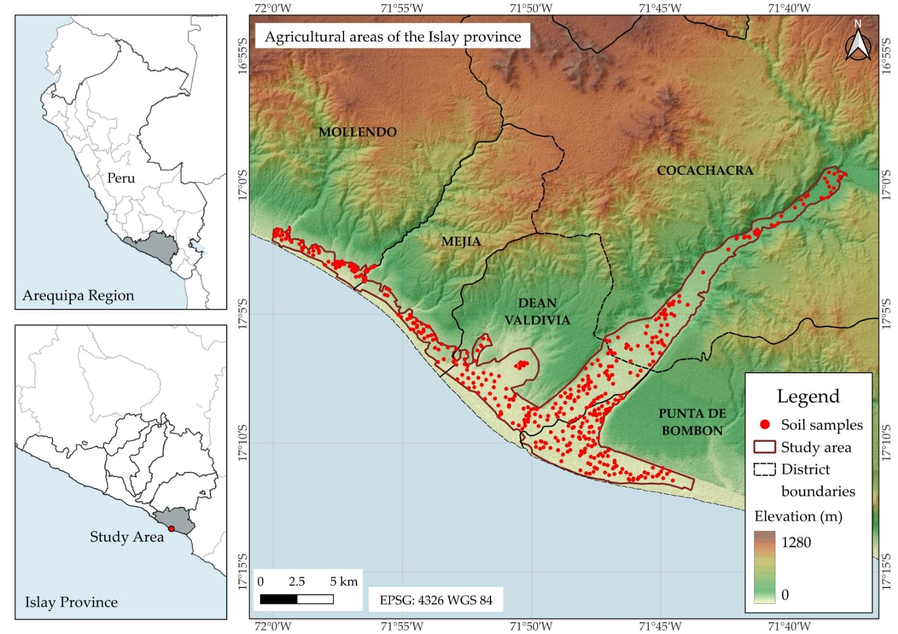
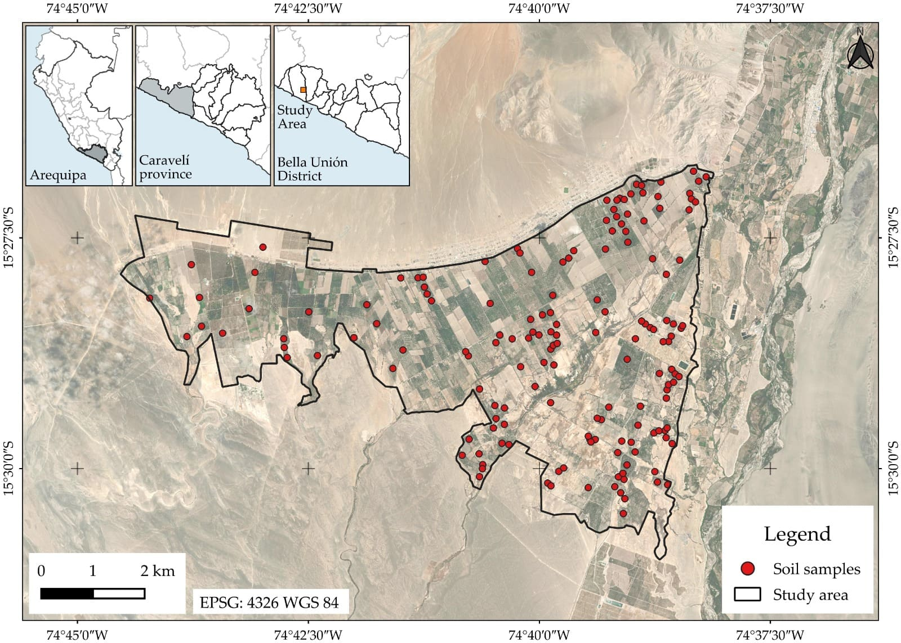
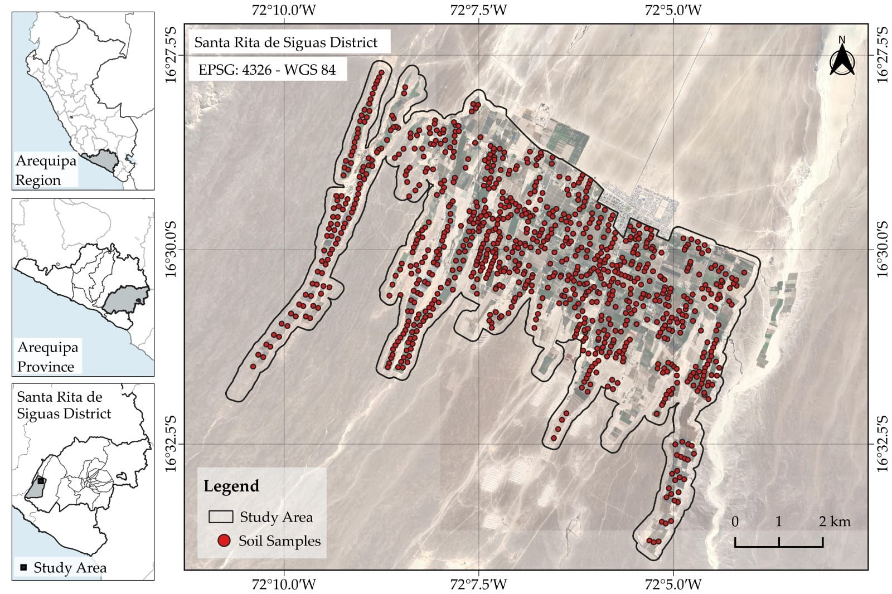
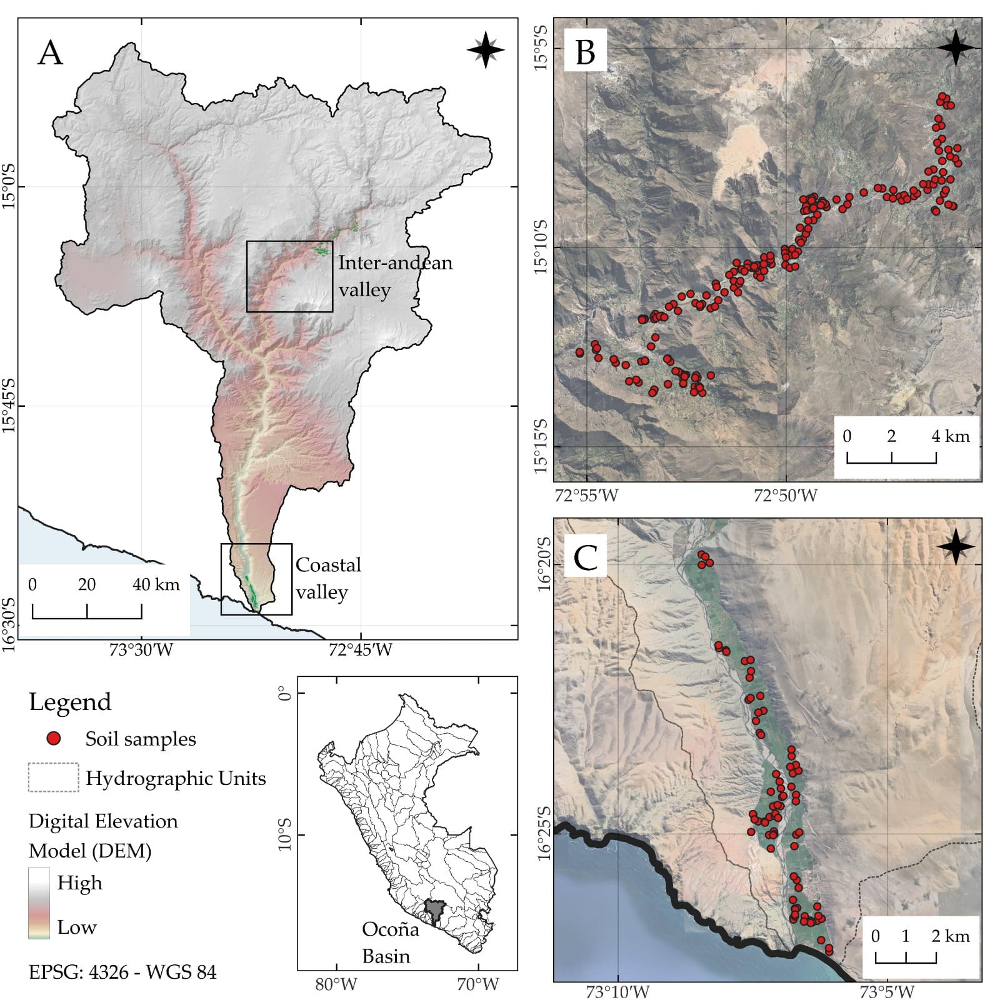
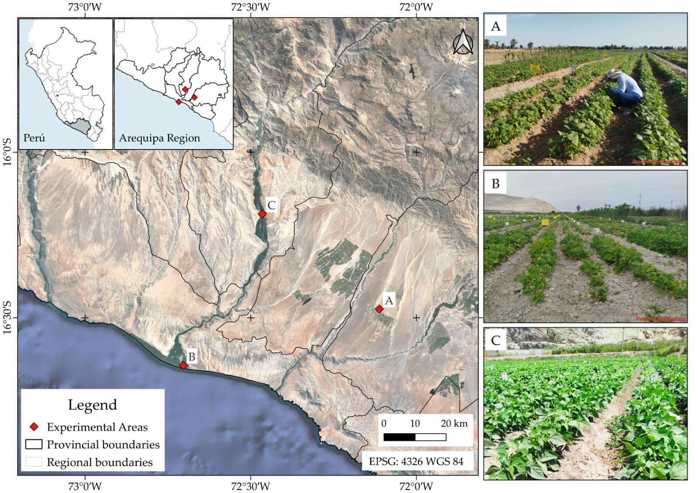
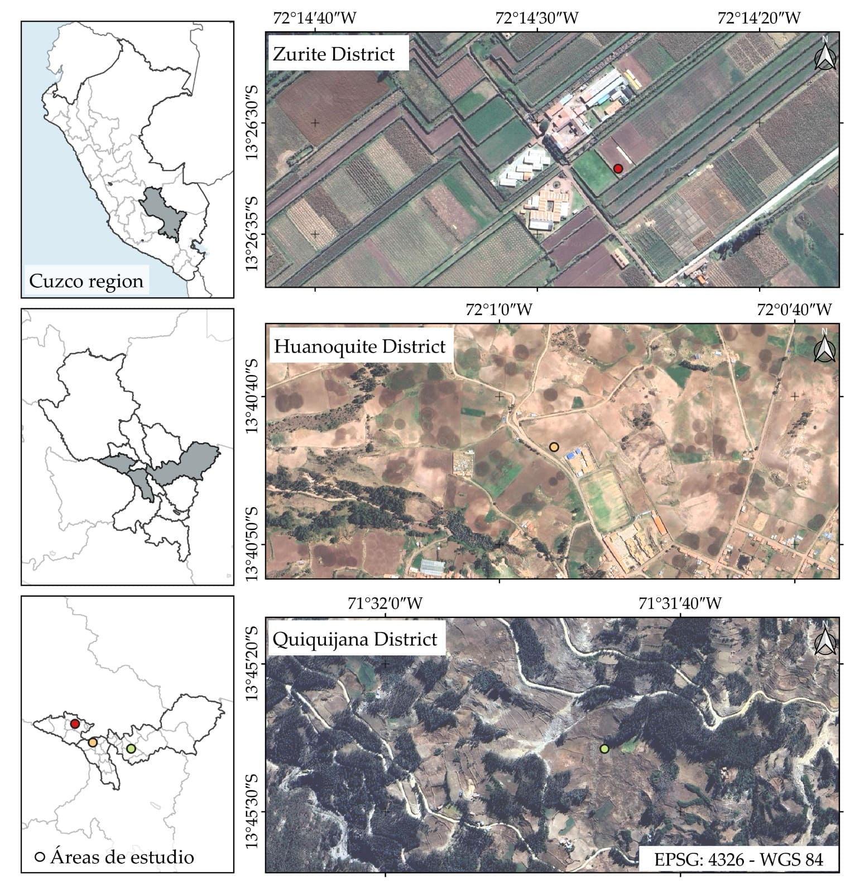
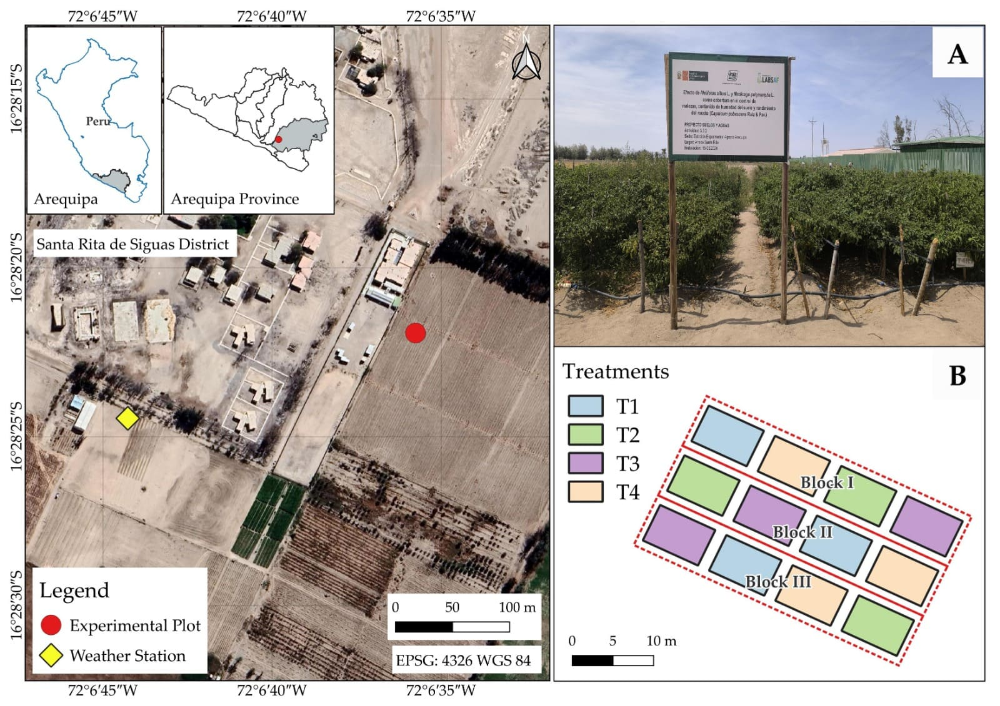
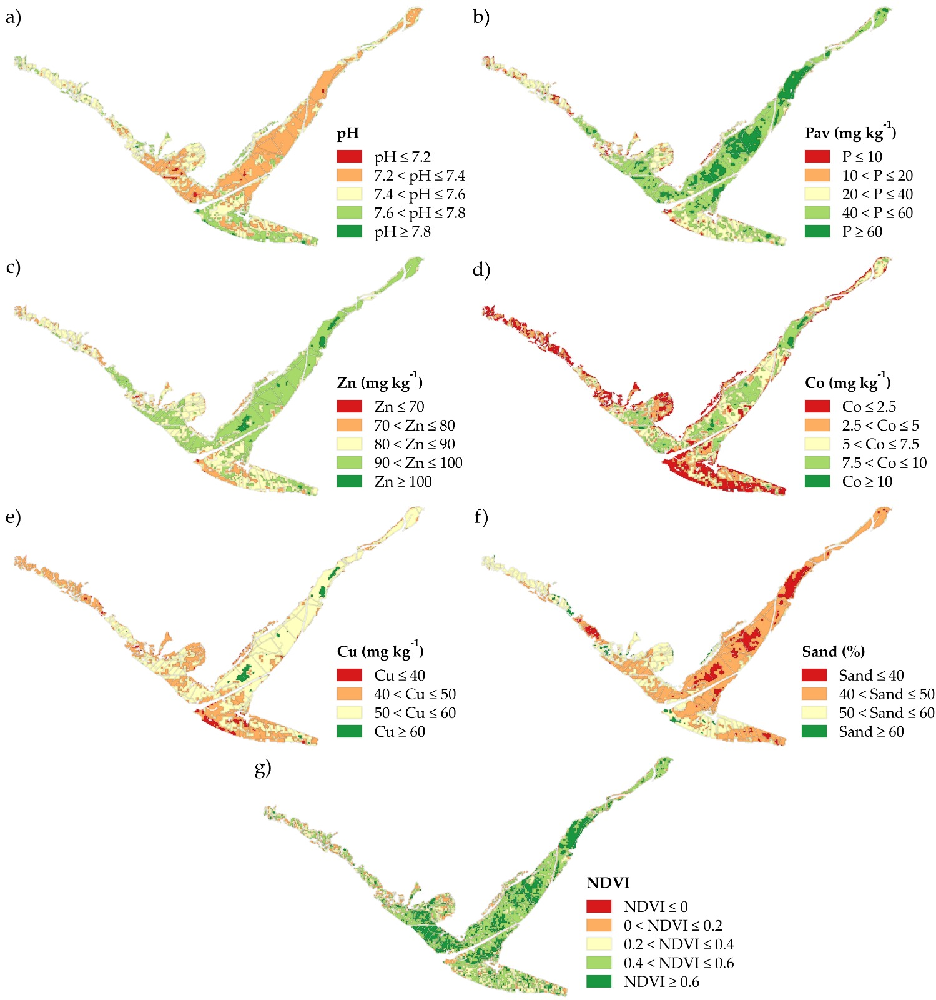
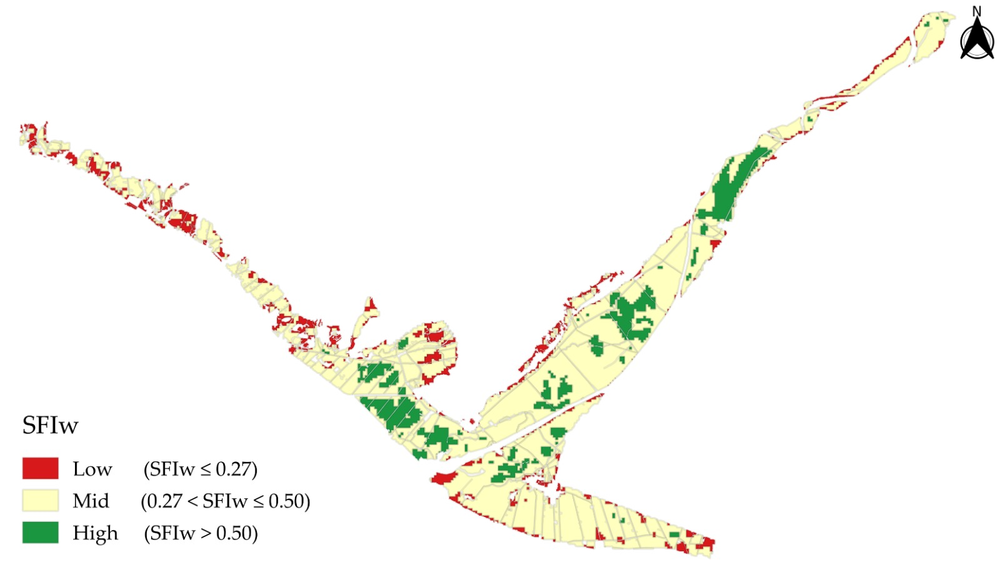
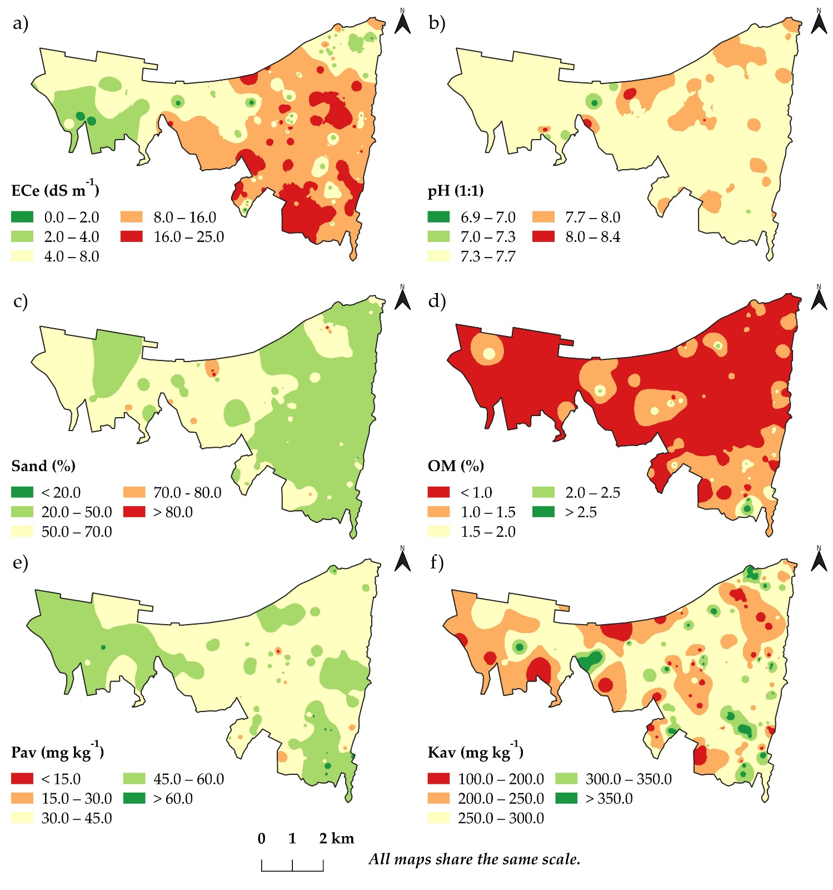

+++
title = 'Elaboración de mapas con QGIS'
date = '2026-03-28'
draft = false
description = 'Elabora tu primer mapa en QGIS de forma sencilla.'
tags = ['QGIS', 'investigación']
categories = []

weight = 6
showtoc = true
ShowPostNavLinks = true
+++

## QGIS aplicado a investigación

QGIS es un software GIS que permite realizar análisis espacial y representar datos de forma gráfica. En investigación, es utilizado para representar información en artículos científicos, reportes o presentaciones.

En esta publicación voy a presentarte algunos ejemplos de mapas elaborados en QGIS, los cuales he realizado para artículos científicos.

## Ejemplos

### Mapas de ubicación

Zonas de muestreo de suelo en el sector Valle del tambo, Islay, Arequipa. Mapa presentado en [Poma et al. (2025)](https://doi.org/10.3389/fsoil.2025.1706974).

Zonas de muestreo de suelos en cultivos de olivo, distrito de Bella Unión, Caravelí, Arequipa. Mapa presentado en [Poma et al. (2026)](https://doi.org/10.3389/fsoil.2026.1724235).

Zonas de muestreo de suelos en zonas agrícolas del distrito de Santa Rita.

Mapa de ubicación para investigación en cuenca Ocoña. Dos zonas de estudio: valle interandino y valle costero.

Tres lugares de evaluación en Arequipa.

Tres lugares de evaluación en Cuzco.

Mapa de ubicación con representación de tratamientos mediante DBCA. Mapa presentado en [Poma et al. (2025)](https://doi.org/10.3389/fagro.2025.1663633).

### Mapas temáticos

Representación de propiedades evaluadas en [Poma et al. (2025)](https://doi.org/10.3389/fsoil.2025.1706974). Se utilizó Kriging de regresión como método de interpolación.

Representación del índice de fertilidad obtenido mediante análisis estadístico.

De forma similar, en [Poma et al. (2026)](https://doi.org/10.3389/fsoil.2026.1724235) se presentó mapas de propiedades interpoladas mediante método IDW.

Así como la representación de agrupaciones entre datos mediante análisis LISA.

## Referencias

Artículos científicos
- Poma-Chamana, R., Vilca-Gamarra, C., Hermoza, N., Mercado, R., Mejía, S., Rengifo, R., & Quispe, K. (2025). Estimation and mapping of soil fertility index in arid agricultural environments of the Tambo Valley using regression kriging. *Frontiers in Soil Science*, 5, 1706974. [Enlace](https://doi.org/10.3389/fsoil.2025.1706974)
- Poma-Chamana, R., Vilca-Gamarra, C., Linares-Escapa, S., Puma-Huacani, K., Carrillo, A., Villalta-Soto, M., & Quispe, K. (2026). Soil Quality in Olive Orchards of Southern Peru Using a Weighted Soil Quality Index (SQIw): Constraints by Salinity, Organic Matter and Sustainable Management Approach. *Frontiers in Soil Science*, 6, 1724235. [Enlace](https://doi.org/10.3389/fsoil.2026.1724235)
- Poma-Chamana, R., Cama-Moreno, E., Flores-Marquez, R., Quello, A., & Solórzano, R. (2025). Evaluating soil cover strategies for enhancing water conservation, biomass contribution, and weed control in rocoto pepper (Capsicum pubescens Ruiz & Pav.) cultivation under arid conditions. *Frontiers in Agronomy*, 7, 1663633. [Enlace](https://doi.org/10.3389/fagro.2025.1663633)

---

Muchas gracias por leer. Te invito a revisar los demás posts mediante los tags aquí abajo.