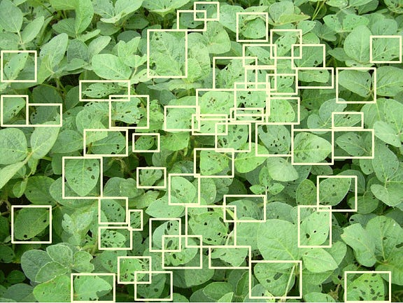
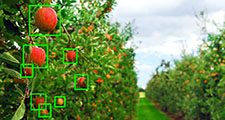

+++
title = 'Computer Vision en la Agricultura: El ojo de la IA en el campo'
date = '2026-03-06T03:35:46-05:00'
draft = false
description = ''
tags = []
categories = []

weight = 5
showtoc = true
ShowPostNavLinks = true
+++

La agricultura moderna se encuentra en una encrucijada donde la eficiencia y la precisión ya no son opcionales, sino necesarias. En este contexto, la capacidad de "ver" y "entender" el entorno de forma automatizada está revolucionando la manera en que gestionamos los cultivos. En este post, exploraremos los fundamentos de la Visión por Computadora (Computer Vision) y cómo se está aplicando actualmente para optimizar la producción agrícola.

*Identificación de hojas afectadas por plagas.*

---

## ¿Qué es exactamente Computer Vision?

De manera concisa, **IBM** define este campo de la siguiente manera:

> "La visión por computadora es un campo de inteligencia artificial (IA) que permite que las computadoras y los sistemas obtengan información significativa de imágenes digitales, videos y otras entradas visuales, y tomen acciones o hagan recomendaciones basadas en esa información. Si la IA permite que las computadoras piensen, la visión por computadora les permite ver, observar y comprender."

A diferencia del ojo humano, que cuenta con el contexto de toda una vida para distinguir objetos y distancias, las máquinas deben ser entrenadas mediante cámaras, datos y algoritmos complejos. Sin embargo, una vez capacitado, un sistema de visión por computadora puede procesar miles de imágenes por minuto, detectando anomalías imperceptibles para nosotros.

Por otro lado, **Sushant Kumar Jha** menciona en Medium:

> "Los seres humanos usan sus ojos y su cerebro para ver y sentir visualmente el mundo que los rodea. La visión por computadora es la ciencia que tiene como objetivo brindar una capacidad similar, si no mejor, a una máquina o computadora. Se ocupa de la extracción, el análisis y la comprensión automática de información útil y significativa."

Esta capacidad de otorgar "sentido visual" a las máquinas es lo que permite hoy en día automatizar procesos que antes dependían exclusivamente de la inspección manual y subjetiva.

---

## Aplicaciones en el sector agrícola

Para entender el potencial de esta tecnología, debemos preguntarnos: **¿Qué proceso repetitivo que dependa de la vista puede ser automatizado?** En el campo, esto se traduce en una disminución drástica del trabajo manual y un aumento en la precisión del monitoreo.

### Caso de éxito: Conteo de frutos (Bitwise Agronomy)

Un ejemplo destacado es el trabajo de **Bitwise Agronomy**, una empresa que, en colaboración con la startup **SpaceAG**, utiliza Inteligencia Artificial para la identificación de objetos en cultivos de agroexportación.

Mediante modelos de *Machine Learning* entrenados en la nube, es posible realizar el conteo de frutos y el análisis de estados fenológicos de forma masiva.

<!-- *Identificación de flores de arándanos indicando el porcentaje de certeza del modelo.* -->

Como se observa en las implementaciones de estas tecnologías, el sistema puede identificar flores en estados específicos de desarrollo, permitiendo a los agricultores predecir mejor sus cosechas y optimizar la logística.

Para profundizar más en su labor, puedes visitar:
* [Bitwise Agronomy Website](https://www.bitwiseag.com/)
* [Bitwise Agronomy en LinkedIn](https://www.linkedin.com/company/bitwise-agronomy/)

---

## Conclusiones

La Visión por Computadora no es solo una herramienta de visualización; es un puente entre el mundo biológico y el análisis de datos masivos (Big Data). En la agricultura, su implementación permite pasar de una gestión generalizada a una **agricultura de precisión**, donde cada planta puede ser monitoreada y atendida individualmente.

Aunque el reto de entrenar modelos precisos para entornos variables (como campos con luz solar cambiante o follaje denso) sigue presente, la integración de lenguajes como Python y JavaScript en plataformas como Google Earth Engine está democratizando el acceso a estas capacidades analíticas para investigadores y productores por igual.

---

## Referencias y mayor información

1. [IBM - What is Computer Vision?](https://www.ibm.com/topics/computer-vision)
2. [Sushant Kumar Jha - Computer Vision In Agriculture](https://medium.com/@sushantjha8/computer-vision-in-agriculture-4cc7b021fefb)
3. [How Artificial Intelligence is helping into photogrammetry?](https://medium.com/@sushantjha8/how-artificial-intelligence-can-help-in-photogrammetry-with-drones-95046a4c8fd4)

---
*Muchas gracias por leer. ¡Saludos!*

