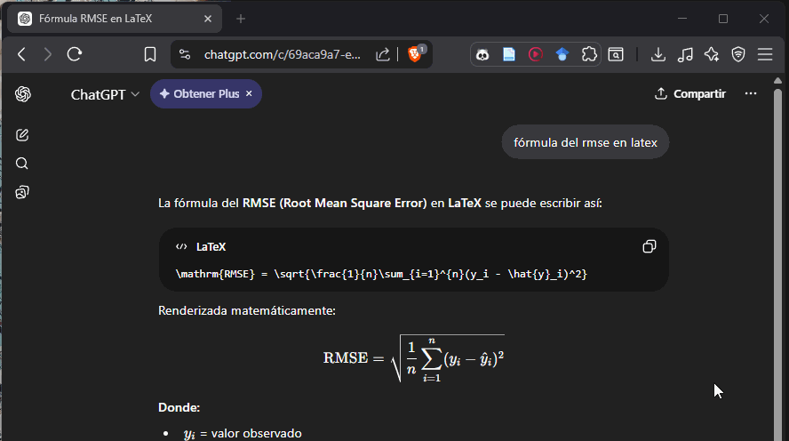
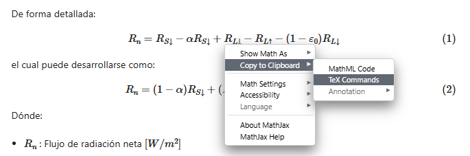

+++
title = 'Fórmulas estilo "publicación" usando LaTeX'
date = '2026-03-06T03:36:35-05:00'
draft = false
description = 'Fórmulas con lenguaje Latex renderizados en la web usando Mathjax.'
tags = ['Latex']
categories = []

weight = 4
showtoc = true
ShowPostNavLinks = true

math = true

+++

## Qué es LaTeX

$\LaTeX$ es un sistema de composición de textos de alta calidad, utilizado mayormente en documentos técnicos o científicos de todo tipo de tamaños y empleandose en cualquier formato editorial. Es muy utilizado para la composición de artículos académicos, tesis y libros técnicos, donde la calidad tipográfica son comparables a la de una editorial científica de primera línea. Es considerado un programa profesional para creación de documentos donde su principal ventaja es que siempre generar un único resultado, el cual puede ser exportado a numerosos formatos. Tiene a su vez en cuenta numerosos aspectos tipográficos editables.

A pesar de ello, lo que nos trae aquí es una parte pequeña de ese universo, las fórmulas. Cuando redactamos un documento técnico científico hay momentos donde debemos presentar una fórmula. Usualmente se trabaja con Word ya que es el más común de todos al ser popular en el sistema Windows. A continuación te presento una forma sencilla de cómo usar la IA de ChatGPT para generar la fórmula y usarla en Word. 



Solo fue necesario copiarlo en una sección de ecuación y dar enter para obtener la fórmula en Word sin problemas. Ahora presentaré las fórmulas renderizadas en esta misma página.

## Representando fórmulas en la web con Mathjax

Mathjax permite renderizar fórmulas LaTeX en la web, con la funcionalidad adicional de poder copiar
la expresión para reutilizarla. Si necesitas usar la fórmula en Word o en un documento LaTeX, solo la copias y pegas donde lo necesites.

Si se tiene el código LaTeX para generar la fórmula del Root Mean Square Error (RMSE):
```latex
$$
\mathrm{RMSE} = \sqrt{\frac{1}{n}\sum_{i=1}^{n}(y_i - \hat{y}_i)^2}
$$
```

y su versión renderizada
$$
\mathrm{RMSE} = \sqrt{\frac{1}{n}\sum_{i=1}^{n}(y_i - \hat{y}_i)^2}
$$

Para poder utilizar esta fórmula en mi blog puedes dar click derecho sobre la fórmula renderizada. Abrirá un menú donde nos interesa el ``Copy to Clipboard/TeX Commands``. 


<!-- Con Mathjax, es posible copiar dicha fórmula  -->
<!--  -->

## Algunas fórmulas utilizadas

### Fórmulas del modelo METRIC

Mapping evapotranspiration at high resolution with internalized calibration (METRIC) es un modelo de procesamiento de imágenes satelitales para calcular la evapotranspiración (ET) como residuo del balance energético superficial (Allen et al., 2007). Este modelo tiene fórmulas interesantes de representar. A continuación presentaré algunas de las más complejas:

**Radiación neta**

$$
R_n = (1- \alpha)R_{S\downarrow} + (R_{L\downarrow} - R_{L\uparrow}) - (1- \varepsilon_0)R_{L\downarrow} \label{eq:rn2} \tag{1}
$$

donde:
- $R_n$ : Flujo de radiación neta 
- $\alpha$ : Albedo de superficie $[-]$
- $R_{S\downarrow}$ : Radiación de onda corta entrante 
- $R_{L\downarrow}$ : Radiación de onda larga entrante 
- $R_{L\uparrow}$ : Radiación de onda larga saliente 
- $\epsilon_0$ : Emisividad del ancho de banda en la superficie

El término $(1- \epsilon_0)R_{L\downarrow}$ representa la fracción de radiación entrante de onda larga (incoming long-wave radiation) reflejada desde la superficie. Todas las radiaciones se miden en $W\;m^{-2}$.

**Flujo de calor del suelo**

$$
\frac{G}{R_n} = ( T_s - 273.15 ) (0.0038 + 0.0074 \alpha ) (1-0.98 \; \text{NDVI}^4) \; \; \; \; \text{(26)}
$$

donde:
- $T_s$ : Temperatura de la superficie $[K]$
- $\alpha$  : Albedo de la superficie $[-]$

**Flujo de calor sensible**

$$
H = \rho_{\text{air}} C_p \frac{dT}{ r_{\text{ah}} }
$$

donde:
- $\rho_{\text{air}}$: Air density $[kg \; m^{-3}]$
- $C_p$: Air specific heat 
- $dT$: Temperature difference (T1 - T2) between two heights (z1 and z2) 
- $r_{\text{ah}}$: Aerodynamic resistance to heat transport 

## Referencias

- [The LaTeX Project: An introduction to LaTeX](https://www.latex-project.org/about/)
- [Universidad de Alicante: Herramientas para la investigación - ¿Qué es LaTeX?](https://desarrolloweb.dlsi.ua.es/cursos/2015/herramientas-investigacion/que-es-latex)

Muchas gracias por leer. Te invito a revisar los demás posts mediante los tags aquí abajo.

