+++
title = 'Google Earth Engine: Procesamiento de imágenes satelitales con JavaScript y Python'
date = '2026-03-06T03:33:32-05:00'
draft = false
description = 'Breve introducción a la plataforma, así como la recopilación de aplicaciones en la Agricultura y demás recursos'
tags = ['Google Earth Engine', 'Python']
categories = []

weight = 3
showtoc = true
ShowPostNavLinks = true
+++

## ¿Qué es exactamente?

[Google Earth Engine](https://earthengine.google.com/) es una plataforma para el análisis científico y la visualización de conjuntos de datos geoespaciales, para usuarios académicos, organizaciones sin fines de lucro, comerciales y gubernamentales.
Nace a partir de una necesidad: disponer de una base de datos geoespaciales a investigadores con poca o nula experiencia previa en administración de bases de datos.

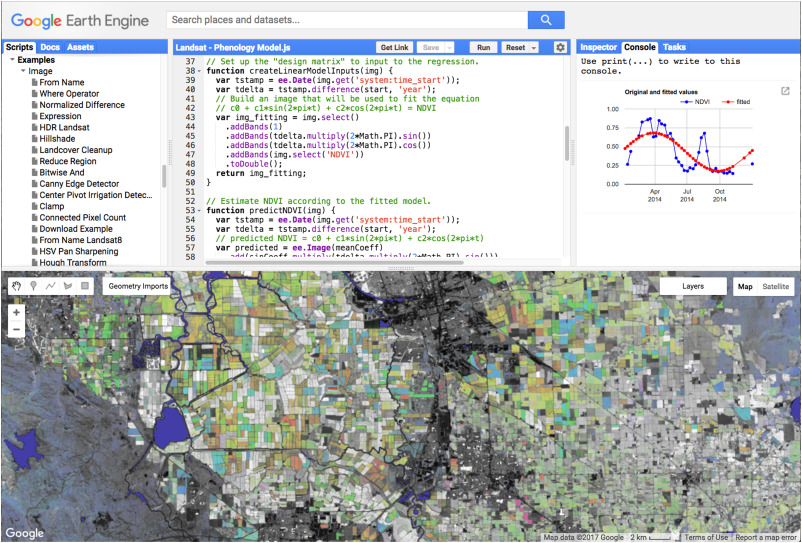

En la sección de Preguntas más frecuentes (FAQ) se menciona lo siguiente:

> Earth Engine es una plataforma para el análisis científico y la visualización de conjuntos de datos geoespaciales, para usuarios académicos, sin fines de lucro, comerciales y gubernamentales.
>
> Earth Engine aloja imágenes de satélite y las almacena en un archivo de datos público que incluye imágenes históricas de la Tierra que se remontan a más de cuarenta años. Las imágenes, que se ingieren a diario, se ponen a disposición para la minería de datos a escala global.
> 
> Earth Engine también proporciona API y otras herramientas para permitir el análisis de grandes conjuntos de datos.

Además, responde a ciertas inquietudes tales como:

- Comparación con Google Earth
- Por qué Google trabaja en este proyecto
- Cómo Acceder
- Bases de datos disponibles
- Limitaciones de uso y más

## Cómo acceder
Earth Engine al ser un proyecto (o aplicación) de Google, permite la conexión con otras aplicaciones tales como Google Cloud, Google Drive (entre las principales). Por ello, requiere una cuenta de gmail activa ([Registrate aquí](https://earthengine.google.com/signup/)).

Nota:
- Es preferible usar cuentas de tipo institucional (universitaria) ya que no presentan limitaciones con el almacenamiento en el Drive. En caso de usar una cuenta corriente de gmail, abstenerse de exportar resultados a su Drive ya que ocuparía el almacenamiento disponible rápidamente al manejar datos geoespaciales (comúnmente archivos pesados).
- Registrar la cuenta en modo no comercial.
- El tiempo de respuesta de activación de cuenta es relativo: puede demorar minutos o hasta horas.

## Ambientes de Desarrollo
Hay dos formas de usar Earth Engine:
- De forma interactiva en la web: Explorer
- Usando lenguajes de Programación para acceder a la Interfaz de Programación de Aplicaciones (API) de Earth Engine:
  - JavaScript: El Code Editor es un IDE desarrollado en la web. Viene con una ventana de visualización ya integrada y otros widgets para edición de figuras geométricas.
  - Python: Mediante el paquete earthengine-api es posible acceder a la API de Earth Engine. Permite trabajar mediante el uso de scripts (.py) o con las libretas jupyter notebooks (.ipynb).
  - R: Mediante la librería rgee (es posible acceder a lenguaje Python en un ambiente de R con la librería reticulate, lo cual ha permitido el acceso a la API de Python).

También existe la integración de Earth Engine en QGIS mediante un plugin.

## Earth Engine Apps
Con Earth Engine Apps es posible construir y diseñar interfaces gráficas dinámicas que realicen análisis específicos y poder compartirlas con otros usuarios de manera privada o pública.

Un ejemplo es la [aplicación](https://minagri-geoespacial.users.earthengine.app/view/dinamicaagricolav3) realizada por el MIDAGRI con nombre *Monitoreo de la Dinámica Agrícola*, la cual permite clasificar cultivos de carácter transitorio, permanente o de descanso a nivel departamental.

A continuación se muestra un vistazo de la misma.

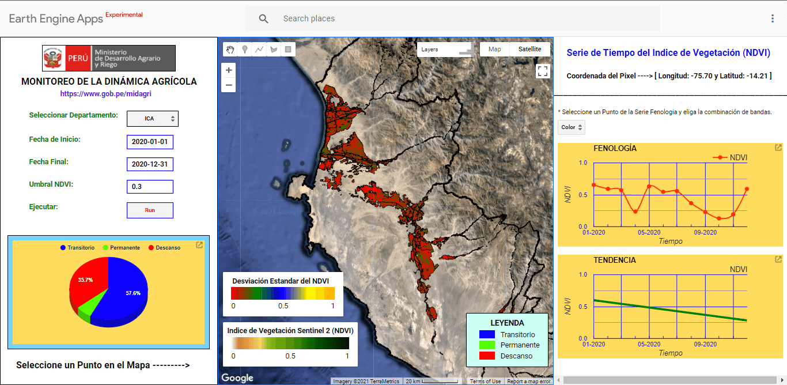

Además, Philipp Gärtner presenta en su blog una recopilación de aplicaciones realizadas por usuarios de Earth Engine:
- [Google Earth Engine Apps - Updated 23th December 2020](https://philippgaertner.github.io/2020/12/ee-apps-table-searchable/) - Lista actualizada
- [Google Earth Engine Apps (March 27, 2020)](https://philippgaertner.github.io/2020/03/ee-apps/) - Adjunta visualizaciones

Para más información puedes visitar en la documentación, la sección [Apps and User Interfaces - Earth Engine Apps](https://developers.google.com/earth-engine/guides/apps) donde explica cómo elaborar paso a paso una interfaz gráfica con Earth Engine.

## Probando EE
A continuación presentaré algunos ejemplos sobre los resultados que he podido generar usando la plataforma de Earth Engine (en Python y JavaScript). Cabe destacar que gracias a su base de datos bien estructurada y el procesamiento en la nube es posible conseguir visualizaciones en cuestión de segundos.

### Usando Javascript
Detector Canny - El algoritmo busca los bordes y los traza
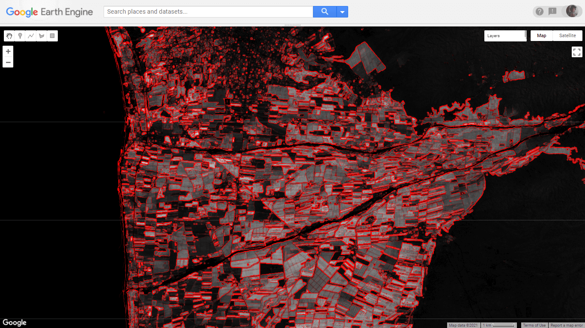

Prueba de sampleo para Clasificación Supervisada
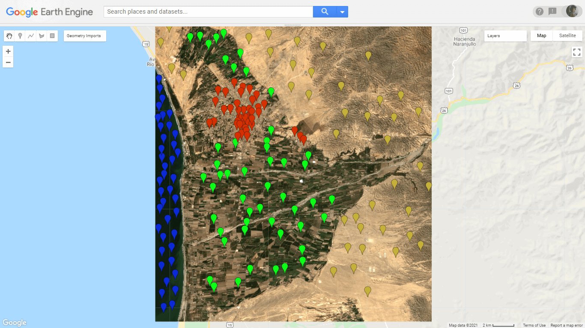
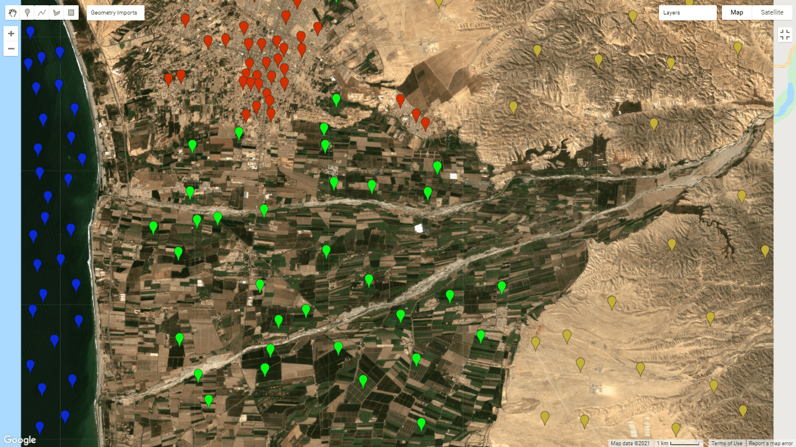

Split Panel: Landsat 8 (lado izquierdo) y Sentinel-2A (lado derecho)
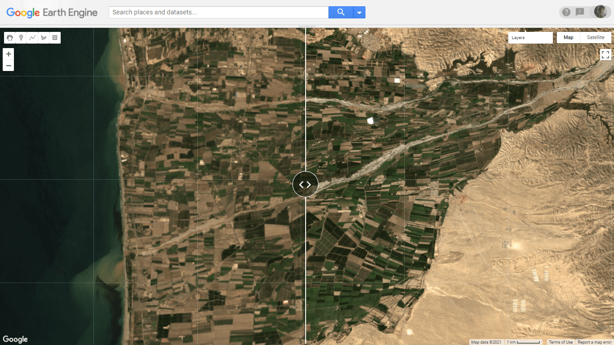

### Usando Python
Valle de Chincha, Dataset: Sentinel-2A
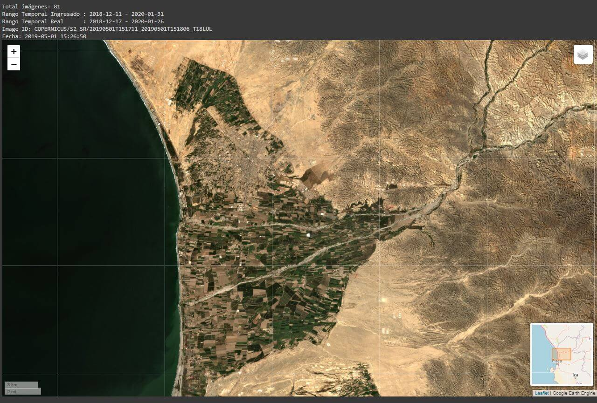

Valle de Chincha, Dataset: Landsat 7 (Nótese el error del escáner a bordo del sátelite lo cual produjo la pérdida del 22% de data en imágenes)
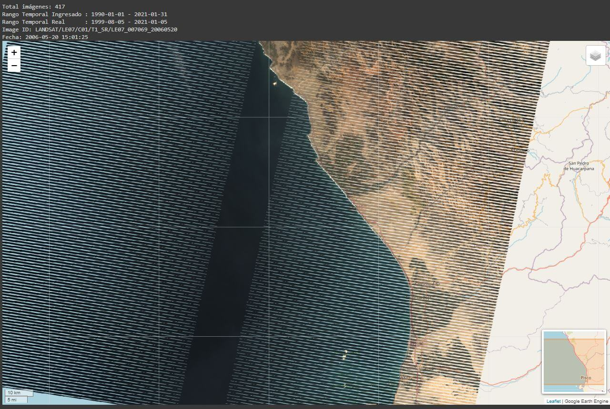

Nevado Yerupajá, Dataset: Sentinel-2A
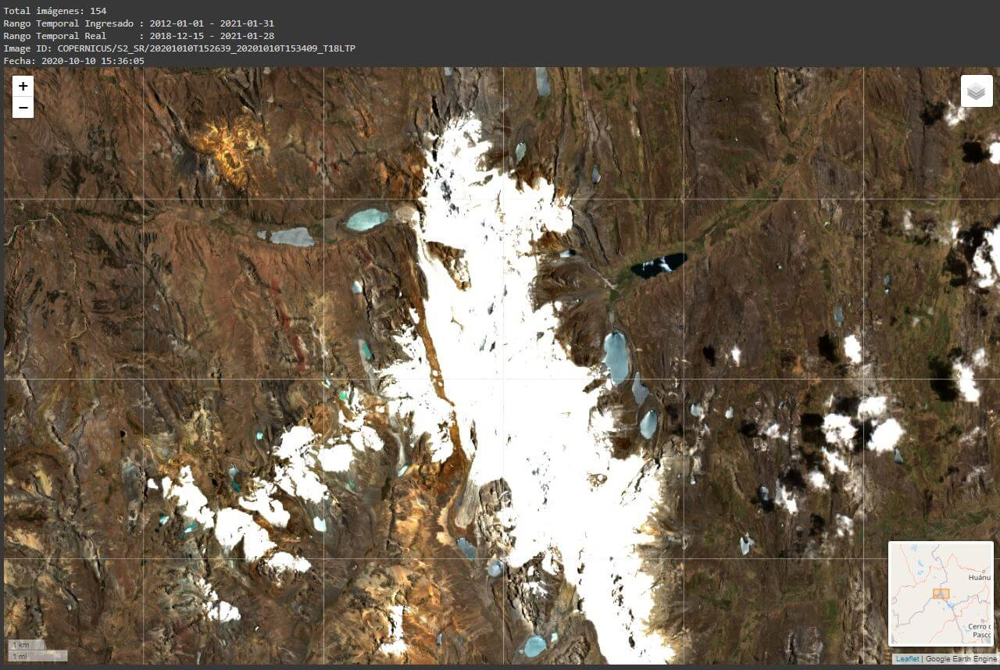

Perú, Dataset: Landsat 7
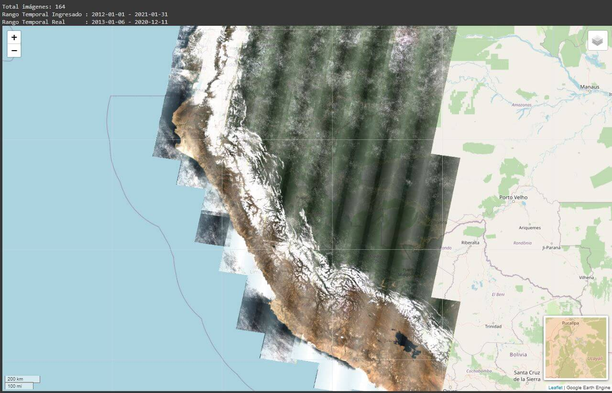

Perú, Dataset: Landsat 8
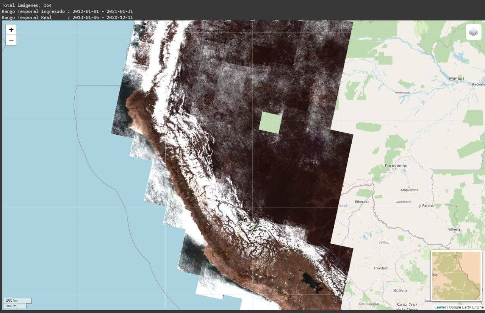

Valle de Chincha - NDVI, Dataset: Sentinel-2A
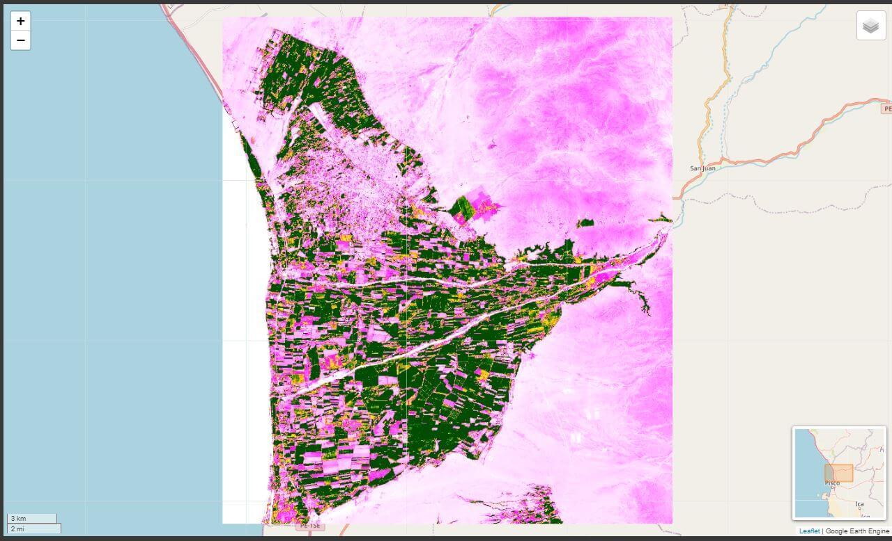

Valle de Chincha - EVI, Dataset: Sentinel-2A
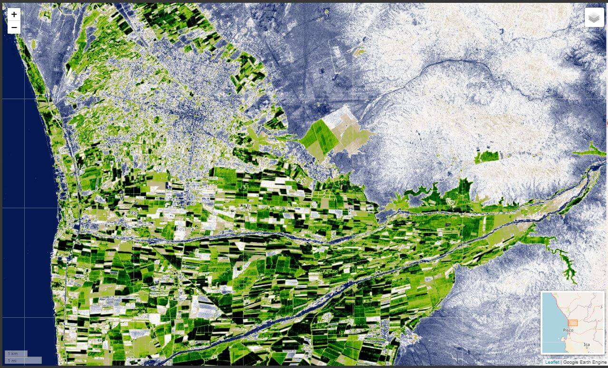

## Conclusiones
La plataforma se encuentra operando desde el año 2011 y ha ido ganando popularidad con el paso de los años debido a la potencia computacional que ofrece de manera gratuita a los investigadores, lo cual ha permitido el aumento de publicaciones académicas en gran cantidad.

## Referencias

- Artículo
  - Gorelick, N., Hancher, M., Dixon, M., Ilyushchenko, S., Thau, D., & Moore, R. (2017). Google Earth Engine: Planetary-scale geospatial analysis for everyone. *Remote sensing of Environment*, 202, 18-27. [http://dx.doi.org/10.1016/j.rse.2017.06.031](https://www.sciencedirect.com/science/article/pii/S0034425717302900)
- Sitios web
  - [Google Earth Engine - Portal](https://earthengine.google.com/)
  - [Google Earth Engine - Creación de cuenta](https://earthengine.google.com/signup/)
  - [Google Earth Engine - Preguntas frecuentes (FAQ)](https://earthengine.google.com/faq/)
  - [Google Earth Engine - Documentación](https://developers.google.com/earth-engine/)
  - Ambientes de Desarrollo e Integraciones disponibles:
    - [JavaScript: Get Started with Earth Engine](https://developers.google.com/earth-engine/guides/getstarted)
    - [Python: Instalación de la API de Python](https://developers.google.com/earth-engine/guides/python_install)
    - [R: Google Earth Engine for R](https://r-spatial.github.io/rgee/)
    - [QGIS: Integrates Google Earth Engine and QGIS using Python API](https://gee-community.github.io/qgis-earthengine-plugin/)
  - [Google Earth Engine API - Repositorio en Github](https://github.com/google/earthengine-api)
  - [Google Earth Engine - Referencia de la API: todos los comandos disponibles en Earth Engine](https://developers.google.com/earth-engine/apidocs)
  - [Google Earth Engine - Guías](https://developers.google.com/earth-engine/guides): (en su mayoría en lenguaje JavaScript)
  - [Google Earth Engine - Tutoriales](https://developers.google.com/earth-engine/tutorials/community/intro-to-python-api-guiattard)

Muchas gracias por leer. Te invito a revisar los demás posts mediante los tags aquí abajo.

